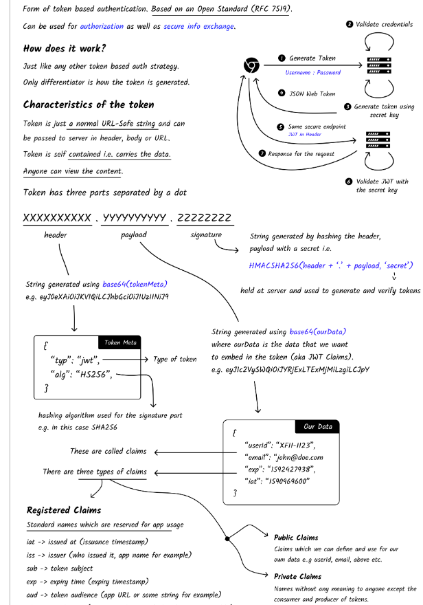
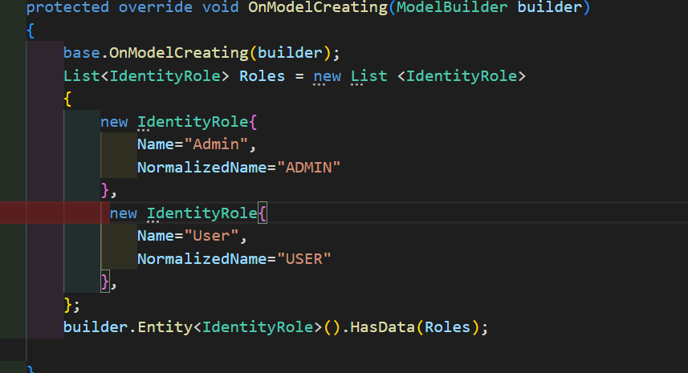
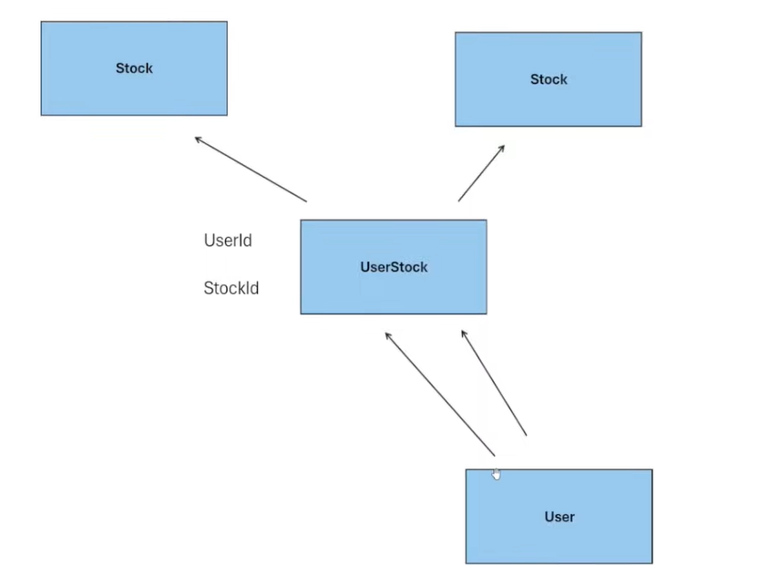
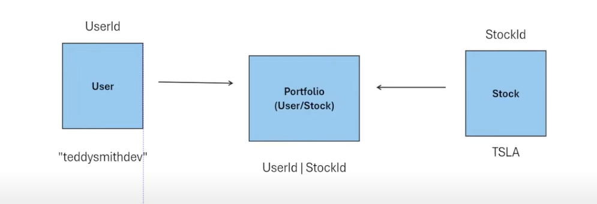

# Getting Started with Create React App

This project was bootstrapped with [Create React App](https://github.com/facebook/create-react-app).

## Available Scripts

In the project directory, you can run:

### `npm start`

Runs the app in the development mode.\
Open [http://localhost:3000](http://localhost:3000) to view it in the browser.

The page will reload if you make edits.\
You will also see any lint errors in the console.

## Install the dependencies:

    - @types/axios: TypeScript definitions for Axios.
        
        npm install --save-dev @types/axios
        
        
    - axios: A promise-based HTTP client for making HTTP requests to APIs.
        
        npm install axios --save
        

    - dotenv: Loads environment variables from a `.env` file into `process.env`.
        
        npm install dotenv
        

    - uuid: Generates RFC-compliant UUIDs for unique identifiers.
        
        npm install uuid
        

    - @types/uuid: TypeScript definitions for the UUID package.
        
        npm install --save-dev @types/uuid
        

    - tailwindcss: A utility-first CSS framework for rapid UI development.
        
        npm install -D tailwindcss
    -npm install -save react-router
    -npm install --save react-router-dom
    npm install --save @types/react-router-dom
    npm install --save @types/react-router
    npm i react-spinners
   - DOT NET Setup 
   dotnet new webapi -o api
   dotnet watch run ---> swagger
   installed all the extenstions such as nuget gallery, C#, DOT NET Extension pack, DOT NET install tool, C# extension by JosKreativ

   ### created models 

   #### 1. Stock Model

   #### 2. Comments Model
        --public int? StockId { get; set; }  // Foreign Key
        --public Stock? Stock { get; set; }  // Navigation property
    ##### Primary Key (Stock.StockId): Uniquely identifies each Stock record.
    ##### Foreign Key (Comment.StockId): Links each Comment to a Stock. It is nullable, meaning a Comment does ##### not have to be associated with a Stock.
    ##### Navigation Property (Comment.Stock): Provides a way to navigate from a Comment to its associated Stock.

    ### ENTITY FRAMEWORK
    ##### From Nuget install the Entity Framework sql server tools, Entity framework tools, design etc. 

    ### Registration and Login 

    #### JWT ( Json based Token )
    
    #### Packages required 
    ##### Microsoft.Extensions.IdentityCore
    ##### Microsoft.AspNetCore.Identity.EntityFrameworkCOre
    ##### Microsoft.AspNetCore.Authentication.JwtBearer

    ### Steps

    ### Intial Steps
    ##### Create a Model for the user - Identity provides with the IdentityUser class
    ##### Let then Application DB context know we are using the Identity DB context
    ##### Add the authentication scheme in the program.cs i.e tell wether you are using the JWT or cookies etc.
    ### Register Service
    #####  We use UserManger class for this purpose
    ##### UserManager class is used for managing users, including operations like creating, updating, deleting users, and managing user roles. It provides an abstraction over user-related operations and interacts with the underlying data store.
    ##### Before creating any user we need to seed the roles, go to ApplicationDbCOntext 
    
    ##### THen create the register method in controller and use DTO to interact with db. CReate register dto and then use that ton create user using createAsync(user)
    #### Claims vs Roles
    ##### previously if you want to get any role, you need to get it from the database. For instance, if there are 20 diff roles and you need to get any role then you need to get them from the db which is cumbersome task
    ##### So, this is where claims come in, they are like a tag associated with the user. They don't use the DB, they are flexible. 
    ##### We are going to generate the JWT  and then stuff it with claims i.e roles like the key value pairs like the things what the user does and what the user can do
    ##### As soon as the JWT enters the server, the HWT is going to be blown away and the stuffed user details are going to be associated with the user each time they use a particular end point, which allows to access it through http context.

    ### Many -To - Many Relationships 

    ##### We want the user to add infinite combinations of stocks to their portfolio and we want other users to be able to add stocks as well too so we need endless combinations of stocks
    
    ##### Create a many to many join table 
    

### `npm test`

Launches the test runner in the interactive watch mode.\
See the section about [running tests](https://facebook.github.io/create-react-app/docs/running-tests) for more information.

### `npm run build`

Builds the app for production to the `build` folder.\
It correctly bundles React in production mode and optimizes the build for the best performance.

The build is minified and the filenames include the hashes.\
Your app is ready to be deployed!

See the section about [deployment](https://facebook.github.io/create-react-app/docs/deployment) for more information.

### `npm run eject`

**Note: this is a one-way operation. Once you `eject`, you can’t go back!**

If you aren’t satisfied with the build tool and configuration choices, you can `eject` at any time. This command will remove the single build dependency from your project.

Instead, it will copy all the configuration files and the transitive dependencies (webpack, Babel, ESLint, etc) right into your project so you have full control over them. All of the commands except `eject` will still work, but they will point to the copied scripts so you can tweak them. At this point you’re on your own.

You don’t have to ever use `eject`. The curated feature set is suitable for small and middle deployments, and you shouldn’t feel obligated to use this feature. However we understand that this tool wouldn’t be useful if you couldn’t customize it when you are ready for it.

## Learn More

You can learn more in the [Create React App documentation](https://facebook.github.io/create-react-app/docs/getting-started).

To learn React, check out the [React documentation](https://reactjs.org/).

## Screenshots

## Home Page

## Login Page

## Search page 

## Search Page- searching for a ticker

##  Particular Company Profile

## Income statement Page

## Balance sheet page 

## Stock Comments

## My portfolio Page

## Stock GPT Page

